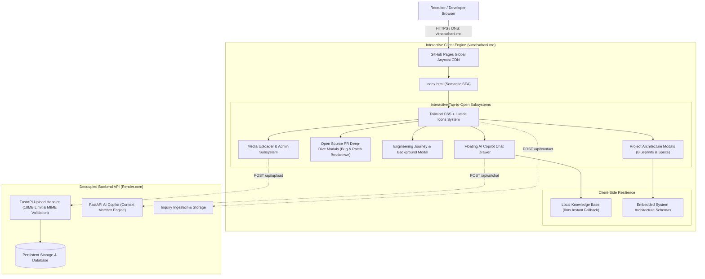

# 🌐 Vimal Sahani — Personal Developer Portfolio & Open-Source Showcase

[](https://vimalsahani.me)
[](https://pages.github.com/)
[](https://vimalsahani.me)
[](https://tailwindcss.com/)
[](https://github.com/VimalN2005)
[](https://github.com/VimalN2005)
[](https://opensource.org/licenses/MIT)

Official source code for the personal developer portfolio and engineering showcase of **Vimal Sahani** (Backend Infrastructure & AI Systems Engineer at **IIIT Bhopal**, Class of '27). Hosted globally on **GitHub Pages** with a custom domain at **[vimalsahani.me](https://vimalsahani.me)**.

---

## 🏛️ 2D Full-Stack Architecture

This portfolio follows a modern **Decoupled Architecture**: a lightning-fast, zero-cold-start static client hosted on GitHub Pages global edge CDN, communicating asynchronously with a scalable FastAPI backend service.



---

## 🌟 Interactive Engineering Features

- **Tap-to-Open Architecture Blueprints:** Tapping any flagship project opens a comprehensive system architecture diagram, component flow, and technical trade-offs without navigating away.
- **Verified Open Source PR Breakdowns:** Deep-dive modals for merged contributions across **Google TensorFlow**, **Django**, **Celery**, and **Hugging Face** detailing the exact bug, ticket number, and engineered solution.
- **Interactive Recruiter AI Copilot:** Floating slide-out chat assistant answering questions regarding Vimal's experience, system design decisions, and internship availability with seamless fallback resilience.
- **Client-Side Media & Photo Uploader:** Interactive file upload modal with live image preview and direct integration with the FastAPI backend endpoint (`/api/upload`).
- **Clean Light Minimalist Design:** High-contrast, typography-focused UI optimized for readability across mobile, tablet, and ultra-wide displays.

---

## 🏆 Featured Open-Source Contributions (19+ Merged PRs)

| Project | Upstream Repository | PR Number | Contribution Focus |
| :--- | :--- | :---: | :--- |
| **Google TensorFlow** | `tensorflow/tensorflow` | [#127639](https://github.com/tensorflow/tensorflow/pull/127639) | Float64 regression test harness for `tf.math.log_sigmoid` second derivative calculations |
| **Django Web Framework** | `django/django` | [#21875](https://github.com/django/django/pull/21875) | Added `django.utils.module_loading.qualname` introspection helper (#36523) |
| **Celery Distributed Queue** | `celery/celery` | [#10605](https://github.com/celery/celery/pull/10605) | Storing task result stamping metadata with extended database backend results |
| **Celery Distributed Queue** | `celery/celery` | [#10606](https://github.com/celery/celery/pull/10606) | Task children propagation handling with database backend (#8336) |
| **Celery Distributed Queue** | `celery/celery` | [#10607](https://github.com/celery/celery/pull/10607) | Multi-server URL sanitization in bugreports (#8014) |
| **Hugging Face Transformers**| `huggingface/transformers` | [#48489](https://github.com/huggingface/transformers/pull/48489) | VibeVoice neural speech synthesis documentation pipeline fixes |
| **Hugging Face Transformers**| `huggingface/transformers` | [#48197](https://github.com/huggingface/transformers/pull/48197) | SigLIP2 Flash Attention implementation code examples |
| **Microsoft PyRIT** | `microsoft/PyRIT` | [#2547](https://github.com/microsoft/PyRIT/pull/2547) | Garak divergence scenario for automated AI red-teaming safety evaluation |
| **LangChain AI** | `langchain-ai/open-swe` | [#2416](https://github.com/langchain-ai/open-swe/pull/2416) | Autonomous software engineering benchmark configuration tables |
| **AutoMQ** | `AutoMQ/automq` | [#3607](https://github.com/AutoMQ/automq/pull/3607) | Compile-time pattern matching type safety across S3 stream storage |
| **Lamatic AgentKit** | `Lamatic/AgentKit` | [#387](https://github.com/Lamatic/AgentKit/pull/387), [#318](https://github.com/Lamatic/AgentKit/pull/318) | Bug-to-test-case generator and Notion assistant agent workflow templates |
| **EvalPort** | `adhabnr-ux/evalport` | [#26](https://github.com/adhabnr-ux/evalport/pull/26), [#19](https://github.com/adhabnr-ux/evalport/pull/19) | Universal Humanloop and Parea OpenEval adapter integrations |

---

## 🚀 The Big 5 Flagship Systems

1. **[AI Agent Evaluation & Reliability Platform](https://github.com/VimalN2005/AI-Agent-Evaluation-Reliability-Platform)**  
   *Benchmarking, Hallucination detection, RAG retrieval quality, latency & cost evaluation using FastAPI, Celery, and Docker.*
2. **[socialFeed: High-Throughput Distributed Feed Engine](https://github.com/VimalN2005/socialFeed)**  
   *Hybrid fan-out timeline architecture, keyset cursor pagination, Min-Heap ranking, documented with 20 Architectural Decision Records (ADRs).*
3. **[DevPilot: RAG-Powered Codebase Intelligence](https://github.com/VimalN2005/DevPilot)**  
   *AST code parser, vector database chunking, and automated GitHub PR code reviews.*
4. **[FluxMesh: Distributed Job Orchestrator](https://github.com/VimalN2005/FluxMesh)**  
   *Task prioritization, worker heartbeat registry, and exponential backoff dead-letter recovery.*
5. **[EdgeFlow: API Gateway & Model Failover Proxy](https://github.com/VimalN2005/EdgeFlow)**  
   *Token bucket rate limiting, circuit breaker pattern, and automated multi-provider LLM failover.*

---

## 🛠️ Local Development & Preview

```bash
# 1. Clone repository
git clone https://github.com/VimalN2005/VimalN2005.github.io.git
cd VimalN2005.github.io

# 2. Open locally using any static file server
python -m http.server 3000
# or npx serve .
```

Open `http://localhost:3000` in your web browser.

---

## 👤 Author

**Vimal Sahani**  
B.Tech IT @ IIIT Bhopal ('27) • Backend Infrastructure & AI Systems Engineer  
- 🌐 Website: [vimalsahani.me](https://vimalsahani.me)  
- 🐙 GitHub: [@VimalN2005](https://github.com/VimalN2005)  
- 💼 LinkedIn: [vimal-sahani](https://www.linkedin.com/in/vimal-sahani)  
- 📧 Email: [vimalsahani2005@gmail.com](mailto:vimalsahani2005@gmail.com)